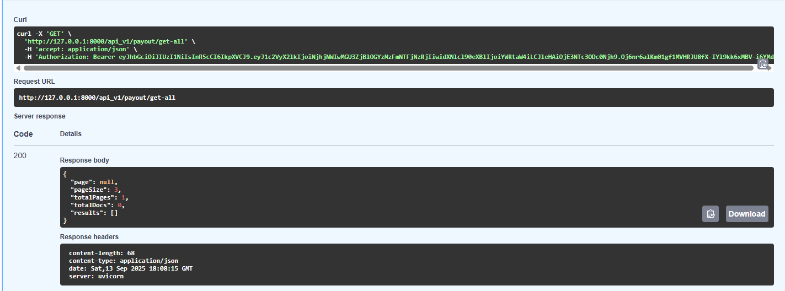
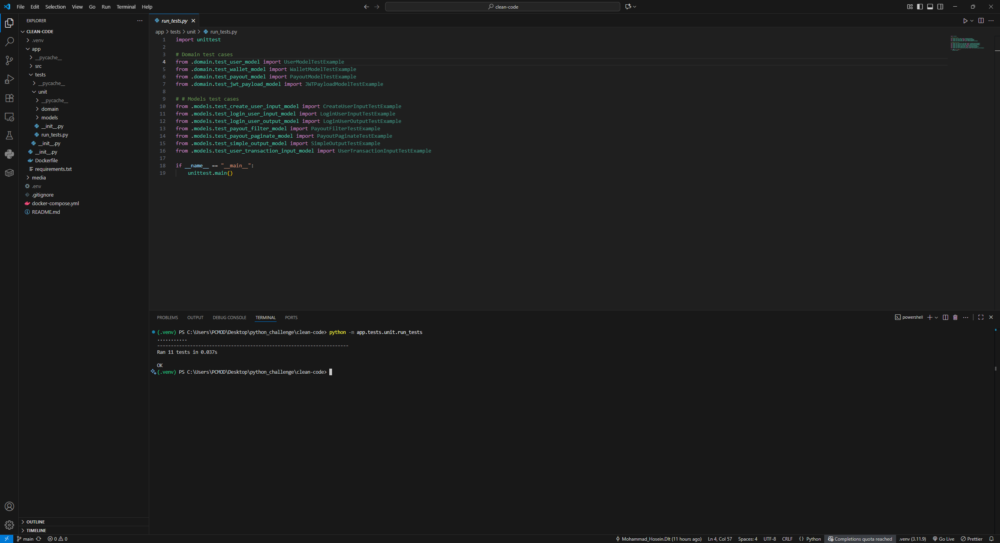

[Implemations and changes](#implementations-and-changes)

[Mock data (insert with python)](#mock-data)

[Unit test](#unit-tests)

ENV File Parameters

Put it next to the app

```
EXTERNAL_FASTAPI_PORT = 80
INTERNAL_FASTAPI_PORT = 8000

MONGO_HOST = mongo-db
MONGO_PORT = 27017
MONGO_INITDB_ROOT_USERNAME = root
MONGO_INITDB_ROOT_PASSWORD = rootpassword
MONGO_INITDB_DATABASE = db

JWT_SECRET = uDQs2sC8L6LDufZMdAdyhpge1rZPrj0XhYyxBBg8hCs=
JWT_ALGORITHM = HS256
JWT_EXPIRATION_MINUTES = 10

DEFAULT_PAGE_SIZE = 3
```

To Run

```
fastapi dev app/src/main.py
```

## App architecture description

### Infra Layer

In this layer, the application infrastructure is defined, such as:

- Authentication utilities such as token creation, management, and validation

- Database client and its models (tables)

- Errors related to this layer and other layers

  - include status code and message

- Services for interacting with external APIs

  - include interfaces and their implementation

- Fastapi config such as

  - middleware
  - tasks that should be run on startup or shutdown, such as create and close database client
  - implement some states based on settings loaded from .env in main app, to have access them throughout the entire project

- Mixin classes

- Application settings load from the `.env` file
  - load with pydantic_settings

```
infra/
│
├── auth/
│   └── <files or directories...>
│
├── db/
│   ├── redis/
│   │   └── <files or directories...>
│   │
│   ├── mongodb/
│   │   └── <files or directories...>
│   │
│   └── sqlite/
│       └── <files or directories...>
│
├── exceptions/
│   └── <files...>
│
├── external_api/
│   ├── interface/
│   │   └── <files...>
│   │
│   └── service/
│       └── <files...>
│
├── fastapi_config/
│   └── <files...>
│
├── mixins/
│   └── <files...>
│
└── settings/
    └── <files...>
```

### Domain Layer

In this layer, data models are defined that are only used inside the application, meaning between layers, for transferring data.

```
domain/
├── mock_data/
│   └── <files...>
│
└── schemas/
    └── <schema_group_name>/
       └── <files...>
```

### Models Layer

In this layer, data models are defined that are only used for receiving or sending data to the client.

```
models/
├── filter/
│   └── <files...>
│
└── schemas/
    └── <schema_group_name>/
        └── <files...>

```

### Repo Layer

In this layer, communication with the database is handled.
Repository classes are defined here, whose methods provide interaction with the database.
Each repository class inherits from an interface defined in this layer.
Interfaces define the structure of database communication, so we can have multiple repository classes based on a single interface and use them for dependency injection.

```
repo/
├── interface/
│   └── <files...>
│
└── <implementation_name>/
    └── <files...>
```

Naming implementations can be based on:

- **Storage type** — for example: `sql`, `nosql`

```
repo/
├── interface/
│   └── <files...>
│
├── sql/
│   └── <files...>
│
└── nosql/
    └── <files...>
```

- **Storage name** — for example: `postgresql`, or `mongodb`.

```
repo/
├── interface/
│   └── <files...>
│
├── postgresql/
│   └── <files...>
│
└── mongodb/
    └── <files...>
```

### Routes Layer

In this layer, endpoints are defined along with their dependencies, response statuses, and other endpoint-related configurations.

```
routes/
├── api_endpoints/
│   ├── <endpoint_group_name>/
│   │   └── <files...>
│   │
│   ├── <endpoint_group_name>/
│   │   └── <files...>
│   │
│   └── main_router.py
│
├── depends/
│   └── <files...>
│
└── http_response/
    └── <files...>
```

### Usecase Layer

In this layer, the application’s business logic is defined.
This layer acts as an important bridge between endpoints in the Routes layer, the database in the Repo layer, and external APIs in the Infra layer.

```
usecase/
├── <usecase_group_name>/
│   └── <files...>
│
└── <usecase_group_name>/
    └── <files...>
```

#### Note

The layers are not limited to the mentioned items and can also include other related configurations.

## Implementations and Changes

### Deploy and run with **docker compose**

## Files and Paths

- **Settings** -> as class -> `infra.settings.settings.py`

- **JWTPayload** -> as class -> `infra.auth.jwt_handler.py`

- **JWTPayload** -> as class model -> `domain.schema.auth.jwt_payload.py`

- **Auth dependencies** -> as functions -> `routs.depend.auth_depend.py`

- **Mongodb client** -> as isinstance of `AsyncMongoClient` of pymongo -> `infra.db.mongodb.client.py`

- **Mongodb collections** -> as class models -> `infra.db.mongodb.collections/`

- **Repositories** -> as class model -> `repo.mongodb/`

- **PayoutFilter** -> as class model -> `models.filter.payout_filter.py`

- **PayoutPaginate** -> as class model -> `models.schemas.payout.payout_paginate.py`

- **Payouts endpoint** -> as **payout/get-all** endpoint -> `routes.api_v1.payout.get_all_payouts.py`

- **GetAllPayouts** -> as usecase class -> `usecases.payout.get_all_payouts.py`

- **Mock/Test data** -> as list of documents -> `domain.mock_data.mock_data.py`

The collections inherit from the relevant model classes in the `domain.schemas`.

### d_1.py

- All environment variables moved to `.env` and loaded via **Setting**.

- User authentication and validation are all handled through auth dependencies.

- Token handling is managed by `JWTHandler`.

  - Added `create_jwt_token` and `verify_token`.
  - Rewritten `decode_token`.

- Token payload defined in `JWTPayload`.

  - `user_id`: **str**
  - `user_type`: **UserType**
  - `exp`: **datetime**

- Since `user_type` is now in the payload:

  - `check_user_is_admin` and `get_email_from_token` were removed.
  - `user_type` validation is now a auth dependency.

- `get_status_list_from_query` was removed (Pydantic models already handle this).

---

### d_2.py

- Database environment variables moved to `.env`.

  - The database client and its collections are defined in redefined paths.

- Collections are based on Pydantic models in domain schemas.

---

### main.py

- Endpoint inputs are defined as parameters of the `PayoutFilter`.

---

### Pagination Process

- **Endpoint -> payout/get-all**:

  - Inputs come as query as parameters of type `PayoutFilter`, and response is given by executing the `GetAllPayouts` usecase .

- **Usecase -> GetAllPayouts**:

  - Payouts document and count fetched using `get_all_by_filter` and `count_by_filter`, with incoming filter from endpoint.

    - In these two functions, filter query built with `create_query_by_filter` method in `PayoutCollection`.

  - If the incoming request expects payouts along with wallet → handled by `get_balances`.

  **Repositories used in this usescase**

  - `get_all_by_filter` & `count_by_filter` defined in payout repository.

  - `get_balances` defined in user repository.

- Final result returned as a `PayoutPaginate` isinstance.
  - The `snake_to_camel` function was added to `PayoutModel` as an `alias_generator` so that it can be used in the simplest way when assigning values to the `results` parameter in `PayoutPaginate`.

## Mock data

To insert test data into the database with python, related **endpoints** have been defined, which are accessible **only to the admin**. In other words, just like the `payout/get-all` endpoint, these endpoints depend on the `check_admin_access` dependency.

Test data is generated for three collections: **User**, **Wallet**, and **Payout**, during the **initial system startup**.

Since this data is recreated each time the system restarts, **new IDs** are also generated for every document. To ensure that test data remains easily accessible, a list of **predefined IDs** has been included.

Because documents in the **Wallet** and **Payout** collections are linked to the **User** collection via the `user_id` field, these predefined IDs are used **only for user IDs**. For other parameters of type **ObjectId**, new IDs are generated each time.

### Without mock data and empty database, the following response should be received



## Unit tests

The domain and model classes have been tested with unit tests.
So far, 11 tests have been written, and by running the command, you should see all 11 tests pass.

#### To run unit tests:

```
python -m app.tests.unit.run_tests
```


